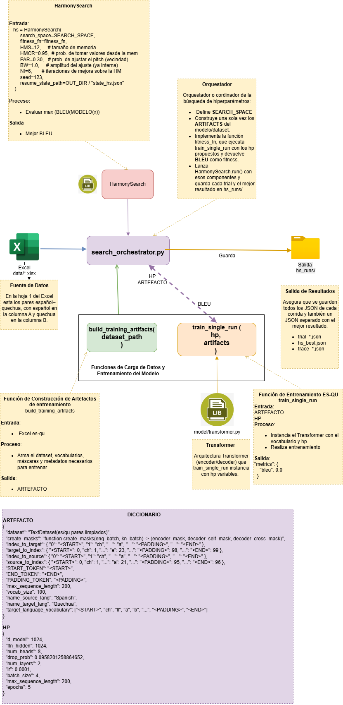
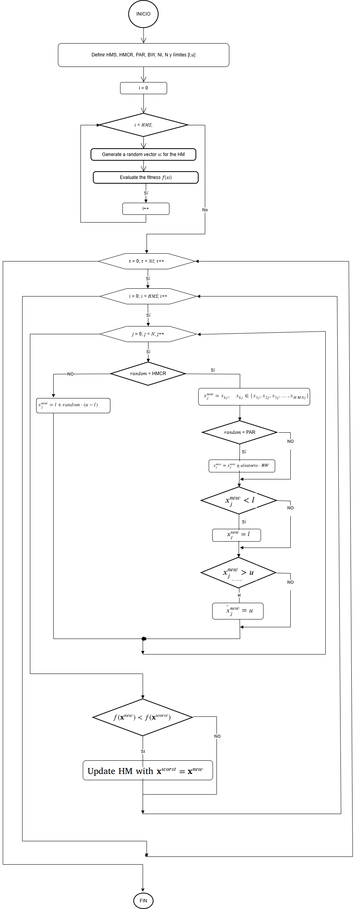

# HS Transformer Quechua (UNI MIA-402)

Proyecto de la asignatura UNI MIA-402: optimizacion de un Transformer de traduccion espanol-quechua usando Harmony Search. Incluye reanudacion por checkpoints, manejo de OOM en el orquestador y dashboards HTML para explorar los trials.

## Requisitos rapidos
- Python 3.10 (sugerido conda): `conda create -n hs_transformer_quechua python=3.10 -y; conda activate hs_transformer_quechua`
- Instalar dependencias: `pip install -r requirements.txt`
- GPU opcional; sin GPU el entrenamiento usa CPU (mas lento).

## Estructura clave
- `main.py`: lanza la busqueda Harmony Search.
- `search_orchestrator.py`: define `SEARCH_SPACE`, `fitness_fn` y orquestacion HS.
- `utils/harmony_search.py`: implementacion HS con estado en `hs_runs/state_hs.json`.
- `model/training.py`: prepara datos y entrena el Transformer con checkpoints.
- `utils/reporting.py`: helpers para leer trials y graficar metricas.
- `scripts/tablero_trials_hs.py`: dashboard HTML (Bootstrap + Chart.js) para `trial_*.json`.
- `scripts/reporte_traza_hs.py`: dashboard HTML (Plotly + Tabulator) para `trace_*.json`.

## Uso basico
1) Activar entorno e instalar dependencias.
2) Colocar el dataset en `data/` (ruta en `config.py` como `DATASET_QUECHUA_PATH`).
3) Ejecutar busqueda HS:
   ```bash
   python main.py
   ```
   Genera `trial_*.json` y `hs_best.json` en `hs_runs/`.
4) Dashboard de resultados (trials):
   ```bash
   python scripts/tablero_trials_hs.py
   # abrir hs_runs/dashboard.html en el navegador
   ```
5) Dashboard de trazas HS:
   ```bash
   python scripts/reporte_traza_hs.py
   # abre el HTML generado en hs_runs/
   ```

## Checkpoints y reanudacion
- Entrenamiento: `train_single_run` guarda checkpoints en `checkpoints/ckpt_<timestamp>.pt` cada `checkpoint_every` epocas. Para reanudar:
  ```python
  train_single_run(hp, artifacts, resume_from="checkpoints/ckpt_XXXX.pt")
  ```
- Harmony Search: guarda estado en `hs_runs/state_hs.json` al final de cada iteracion. Si se interrumpe, relanza `main.py` para reanudar.

## Notas de espacio de busqueda
Ajusta `SEARCH_SPACE` segun recursos (GPU/CPU). Para evitar OOM: `batch_size <= 16`, `d_model <= 256`, `ffn_hidden <= 1024`, `num_layers 2-3`, `num_heads 4`.

## Logs
`utils/logger.py` escribe en `logs/log_YYYYMMDD.txt` y por consola.

## Tokenizacion
- Se usa SentencePiece (BPE) entrenado una sola vez con todo el corpus (ES+QU); guarda `data/spm_es_qu.model` y `.vocab`.
- El tokenizador se genera automaticamente si no existen esos archivos y luego se reutiliza en HS y en entrenamiento manual.
- Tokens especiales fijos: `<PAD>`, `<BOS>`, `<EOS>`, `<UNK>`.

## Diagramas
- Arquitectura: `docs/aquitectura.png`
  
- Flujo Harmony Search: `docs/diagrama_flujo_hs.png`
  

## Algoritmo Harmony Search (resumen)
1) Inicializar Harmonic Memory (HM) con armonias aleatorias dentro del `SEARCH_SPACE`.
2) Repetir hasta `NI` iteraciones:
   - Para cada parametro: con probabilidad `HMCR` tomar valor de HM; si no, muestrear aleatorio. Con probabilidad `PAR` hacer pitch adjustment (ruido controlado por `BW`).
   - Evaluar fitness (BLEU); manejar OOM penalizando con fitness bajo.
   - Si la nueva armonia mejora la peor de HM, reemplazarla.
3) Guardar en `hs_runs/` el mejor trial (`hs_best.json`) y estado (`state_hs.json`) para reanudar.

## Scripts y uso
- `scripts/resumen_entorno.py`: imprime info de entorno, rutas de dataset/salidas y espacio de busqueda HS.
  ```bash
  python scripts/resumen_entorno.py
  ```
- `scripts/dividir_excel_incremental.py`: divide un Excel en partes crecientes (10k, 20k, 30k, ...).
  ```bash
  python scripts/dividir_excel_incremental.py
  ```
- `scripts/particionar_dataset_aleatorio.py`: crea particiones aleatorias del dataset y guarda estadisticas y promedios de longitud.
  ```bash
  python scripts/particionar_dataset_aleatorio.py
  ```
- `scripts/entrenar_modelo_manual.py`: ejecuta un entrenamiento manual con hiperparametros definidos en el archivo (edita `DEFAULT_HP` o `USER_HP_OVERRIDE`).
  ```bash
  python scripts/entrenar_modelo_manual.py
  ```
- `scripts/graficar_entrenos_manual.py`: genera PNG y HTML de metricas (loss/BLEU/ROUGE) para `hs_runs/manual_train_*.json`.
  ```bash
  python scripts/graficar_entrenos_manual.py
  python scripts/graficar_entrenos_manual.py --file hs_runs/manual_train_123.json
  ```
- `scripts/tablero_trials_hs.py`: dashboard para trials HS (`trial_*.json`).
  ```bash
  python scripts/tablero_trials_hs.py
  # abre hs_runs/dashboard.html
  ```
- `scripts/reporte_traza_hs.py`: dashboard avanzado para trazas HS (`trace_*.json`) con Plotly/Tabulator.
  ```bash
  python scripts/reporte_traza_hs.py
  python scripts/reporte_traza_hs.py --trace hs_runs/trace_20250101_120000.json
  ```
- `scripts/traza_hs_a_csv.py`: convierte `trace_*.json` a CSV (mejor armonia por iteracion).
  ```bash
  python scripts/traza_hs_a_csv.py
  python scripts/traza_hs_a_csv.py --file hs_runs/trace_20250101_120000.json
  ```
